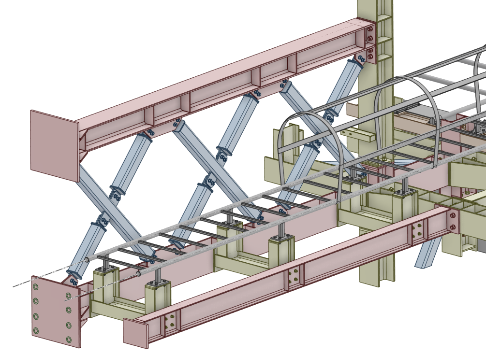
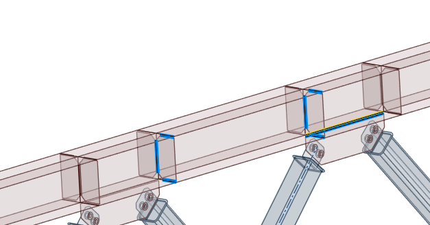
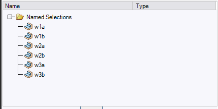

# SpaceClaim Weld Namer

A compact scripting utility for **ANSYS SpaceClaim 2021 R1 / Script API V19** that creates sequential Named Selection groups for weld-preparation workflows and highlights already prepared weld geometry.

The current stable release is **v0.10.0**. It has been validated on the author's real SpaceClaim 2021 R1 installation for the **Edges** workflow, including `DesignEdgeGeneral`, window reopen behavior, sequential group creation, Secondary Selection highlighting, current-pair highlighting, and Auto Highlight.

> SpaceClaim Weld Namer is a SpaceClaim script. It is not a DLL Add-In and not an ACT extension.


## Why I built this

This utility came out of a real engineering task rather than a standalone programming exercise.

While preparing a **large detailed submodel with a large number of welded joints**, I found that manually creating and naming paired Named Selections for every weld quickly became repetitive and easy to get wrong. In the downstream Mechanical model, these selections are needed again for connection generation, checking, and weld-force post-processing.

The scripting possibilities available through **Python / IronPython in ANSYS and SpaceClaim** still keep surprising me. Even in SpaceClaim 2021 R1, a relatively small script can remove a significant amount of repetitive model-tree work without taking the engineering decision away from the user.

So the idea behind SpaceClaim Weld Namer is deliberately **semi-automatic**:

- the engineer still selects the actual weld geometry;
- the script creates the next `wNa / wNb` Named Selection;
- the current weld pair can be highlighted immediately for visual checking;
- the resulting Named Selections can then be transferred into **ANSYS Mechanical** and used directly in the workflow with **MPC184 Viewer**.

In other words, the tool does not try to identify welds by itself. It automates the repetitive naming and bookkeeping around weld geometry while keeping geometry selection under engineer control.

### Example model that motivated the tool

A typical case is a large submodel containing many local welded connections that must be prepared consistently before connection generation in Mechanical.



The current-pair highlight helps verify exactly which edges have already been assigned to a weld pair:



Named Selections are created in a predictable sequence and are then available downstream in Mechanical:



## What it does

Select one or more edges and click **Create Next**. One Named Selection is created using the first free name in the sequence:

```text
w1a -> w1b -> w2a -> w2b -> ... -> w99999999b
```

Several selected geometry items are stored in one group. Existing weld groups are not overwritten. Matching is case-insensitive and gaps are filled automatically.

The next name is recalculated from the Named Selection groups of the **root part on every operation**. There is no separate persistent numbering counter.

## Stable v0.10 features

- Sequential `wNa / wNb` naming.
- Gap-aware numbering and case-insensitive detection of existing weld groups.
- Multiple selected edges in one Named Selection.
- `Edges` mode validated with `DesignEdgeGeneral`.
- `Faces` mode implemented but not yet validated on the real target installation.
- Modeless WinForms UI.
- Safe close/reopen behavior.
- Duplicate-window suppression when the script is run repeatedly.
- Exact weld visualization using **SpaceClaim Secondary Selection** rather than permanent CAD color changes.
- **Auto highlight current pair after Create**.
- **Highlight Current Pair**.
- **Highlight All Weld Groups**.
- **Clear Highlight**.
- Faces/Edges and Auto Highlight state retained between window reopen events within the same SpaceClaim session.
- Diagnostic log: `%TEMP%\SpaceClaim_Weld_Namer_v010.log`.

## Current-pair workflow

The tool is designed for preparing the two sides of a weld as a pair:

```text
Create w5a -> highlight w5a
Create w5b -> highlight w5a + w5b
Create w6a -> highlight switches to w6a
```

This avoids turning a large model into one dense highlight when hundreds of weld groups already exist. **Highlight All Weld Groups** remains available when a global check is needed.

## Why Secondary Selection is used

A color-based prototype accepted edge selections but did not provide the required per-edge visual result on the target SpaceClaim installation. The stable tool therefore does not modify CAD colors.

Secondary Selection:

1. highlights the exact topology stored in the Named Selection groups;
2. does not modify CAD appearance properties;
3. can be cleared independently;
4. is treated as visualization post-processing, so a highlight problem does not invalidate a Named Selection already created successfully.

## Companion project: MPC184 Viewer

SpaceClaim Weld Namer is especially useful together with **MPC184 Viewer** for ANSYS Mechanical:

**MPC184 Viewer:** https://github.com/maximofflove/MPC184Viewer

A practical workflow is:

```text
SpaceClaim Weld Namer
-> create weld-side Named Selections w1a / w1b / w2a / w2b / ...
-> transfer/update the model in ANSYS Mechanical
-> MPC184 Viewer
-> create, validate, visualize, and post-process MPC184 weld connections
```

The two projects are independent, but their weld-group naming workflow is designed to work conveniently together.

## Requirements

- ANSYS SpaceClaim **2021 R1**
- Script API **V19**
- Built-in **IronPython 2.7**
- The **root component / root part must be active** before creating weld groups

Other SpaceClaim versions may work but are not validated by this release.

## Quick start

1. Open the SpaceClaim model.
2. Activate the **root component**.
3. Open `Weld_Namer.py` in the SpaceClaim Script Editor.
4. Select **API V19**.
5. Run the complete script.
6. Select `Edges` or `Faces` in the tool window.
7. Select one or more geometry items of that type.
8. Click **Create Next**.

Use **Check Next Name** to inspect the next available weld-group name without modifying the model.

## UI

- `Faces` / `Edges`
- **Create Next**
- **Check Next Name**
- **Auto highlight current pair after Create**
- **Highlight Current Pair**
- **Highlight All Weld Groups**
- **Clear Highlight**
- Message / diagnostic field

## Naming behavior

| Existing groups | Next group |
|---|---|
| none | `w1a` |
| `w1a` | `w1b` |
| `w1a`, `w1b` | `w2a` |
| `W1A`, `w1b`, `w2a` | `w2b` |
| `w1b` | `w1a` |
| `w1a`, `w2a` | `w1b` |

Only names matching `w<number>a` or `w<number>b` participate in the sequence.

## Validated core API chain

The creation path intentionally retains the calls confirmed on the target installation:

```text
Selection.GetActive()
-> NamedSelection.GetGroups(root)
-> NamedSelection.Create(selection, Selection.Empty())
-> verify exactly one new group
-> NamedSelection.Rename(temporary_name, target)
```

Important V19 observations:

- `Part.Groups` is not available in the tested API.
- `NamedSelection.GetGroups(root)` works reliably.
- Parameterless `NamedSelection.GetGroups()` previously produced a null-reference failure from the modeless callback.
- The WinForms UI is created on the SpaceClaim UI thread through `BeginInvoke`.
- Window state is stored in `AppDomain` and synchronized with `Monitor`.

See [docs/ARCHITECTURE.md](docs/ARCHITECTURE.md).

## Validation status

| Function | Status |
|---|---|
| Edges / `DesignEdgeGeneral` | **Validated on real SpaceClaim 2021 R1** |
| Multiple edges in one group | **Validated** |
| Sequential creation and continuation | **Validated** |
| Window close -> run -> reopen | **Validated** |
| Duplicate-window suppression | **Validated** |
| Secondary Selection weld highlight | **Validated** |
| Auto highlight current pair | **Validated** |
| Highlight Current Pair | **Validated** |
| Highlight All Weld Groups | **Validated** |
| Auto Highlight state after reopen | **Validated** |
| Faces mode | Not yet validated |
| Publish Script as Tool | Not yet validated |
| Hotkey assignment | Not yet validated |

See [docs/VALIDATION.md](docs/VALIDATION.md) for the detailed matrix.

## Repository layout

```text
SpaceClaim-Weld-Namer/
├── Weld_Namer.py
├── README.md
├── README_RU.md
├── CHANGELOG.md
├── RELEASE_NOTES.md
├── LICENSE
├── SUPPORT.md
├── .github/
│   └── FUNDING.yml
├── .gitignore
├── .gitattributes
├── docs/
│   ├── ARCHITECTURE.md
│   ├── VALIDATION.md
│   ├── RELEASE_CHECKLIST.md
│   └── images/                 # README screenshots
└── tools/
    ├── Create_Next_Once.py
    ├── API_Diagnostics.py
    └── Allow_Reopen.py
```

## Diagnostic tools

- `tools/Create_Next_Once.py` — one-shot group creation without the WinForms window.
- `tools/API_Diagnostics.py` — target API diagnostics.
- `tools/Allow_Reopen.py` — emergency state reset after an abnormal launch failure; not required for normal close/reopen operation.

## Roadmap

- Validate `Faces` mode end-to-end.
- Test **Publish Script as Tool** in SpaceClaim 2021 R1.
- Check shortcut conflicts before assigning any hotkey.
- Consider Add-In/ACT packaging only after the scripting workflow is fully mature.

## License

SpaceClaim Weld Namer is free and open-source software released under the **GNU General Public License v3.0 (GPL-3.0)**.

You may use the tool free of charge, including for professional and commercial engineering work, subject to the terms of the GPL-3.0 license. The source code may be studied, modified, and redistributed under those terms. See [LICENSE](LICENSE).

## Support the project

If SpaceClaim Weld Namer saves you time in engineering work and you would like to support further development, you can make a voluntary donation through Boosty:

**Support on Boosty:** https://boosty.to/ansys2021/donate

Support is completely optional. No payment or subscription is required to download the tool or access any feature. See [SUPPORT.md](SUPPORT.md).

## Disclaimer

This project is an independent engineering utility and is not an official ANSYS product. ANSYS and SpaceClaim are trademarks of their respective owners.

Always validate generated Named Selections in the actual engineering model before using them in downstream analysis or automation.
