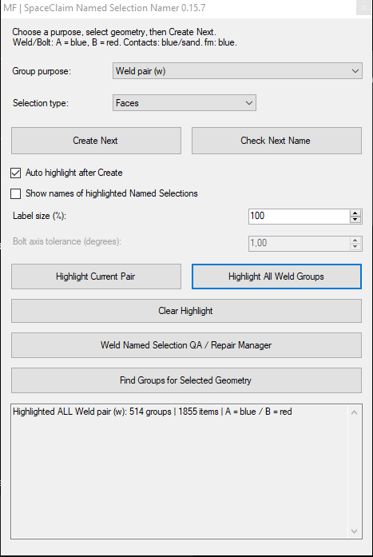
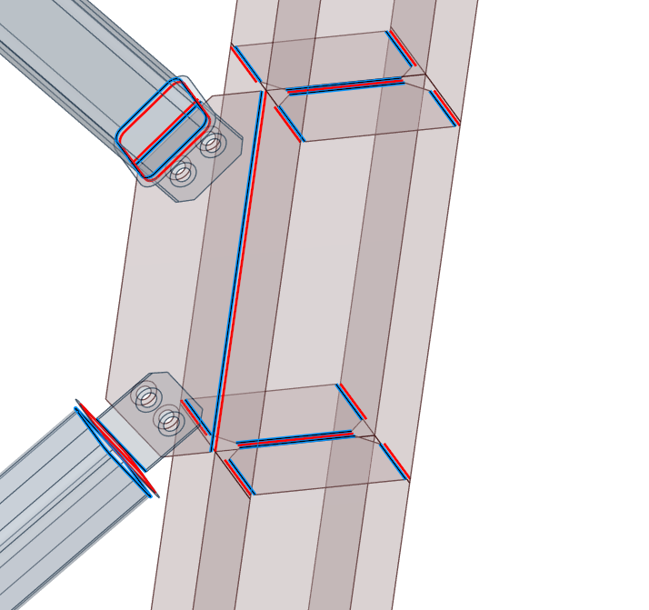
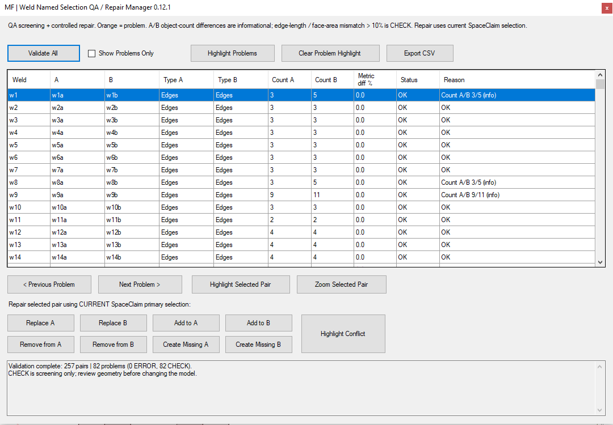
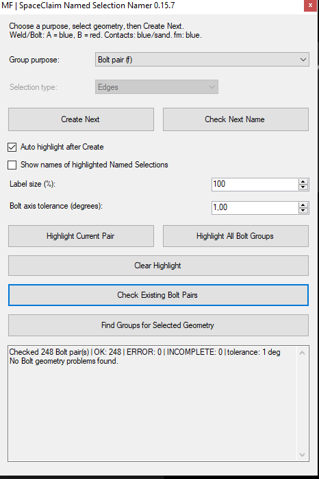
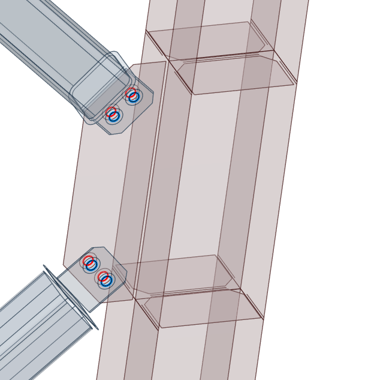
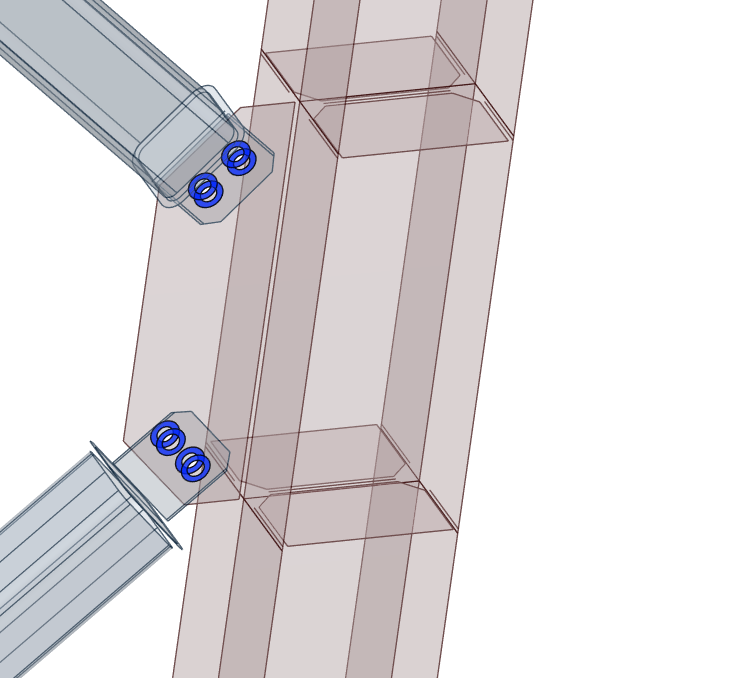
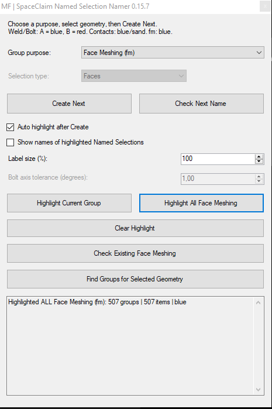
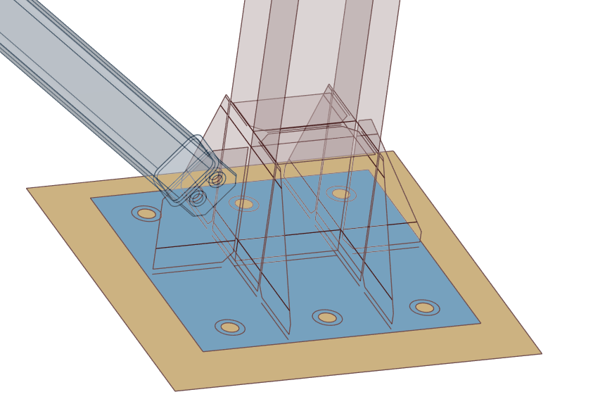
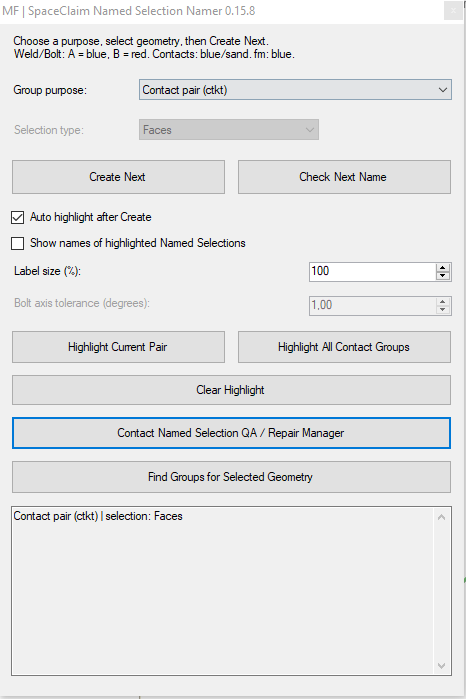
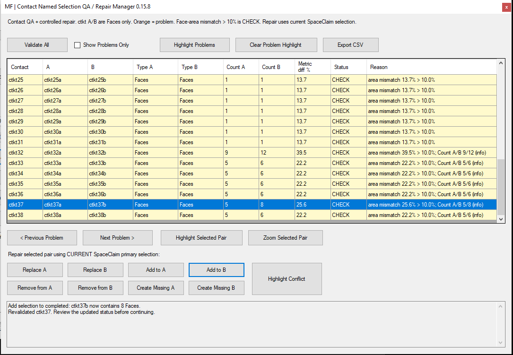

# SpaceClaim Named Selection Namer

Semi-automatic preparation, checking and repair of Named Selections for **ANSYS SpaceClaim 2021 R1 / Script API V19 / IronPython 2.7**.

**Current stable release: v0.15.8**

The tool keeps geometry selection under engineering control while automating naming, visualization, QA and controlled repair around four purposes:

| Purpose | Geometry | Sequence | Visualization |
| --- | --- | --- | --- |
| Weld pair | Faces or Edges | `w1a`, `w1b`, `w2a`, `w2b`, ... | A blue, B red |
| Bolt pair | Edges | `f1a`, `f1b`, `f2a`, `f2b`, ... | A blue, B red |
| Face Meshing | Faces | `fm1`, `fm2`, ... | blue |
| Contact pair | Faces only | `ctkt1a`, `ctkt1b`, `ctkt2a`, `ctkt2b`, ... | A muted blue, B sand |

> This is a SpaceClaim Script Editor tool, not an ACT extension or DLL.

## What is new in v0.15.8

`Contact pair (ctkt)` now uses the same controlled QA / Repair workflow as Weld pairs. For a selected contact pair you can **Replace**, **Add**, **Remove**, or **Create Missing** geometry independently on side A or B. Contact repair is intentionally **Faces only**. After a mutation, the group is re-read and checked before the table is refreshed.

The update preserves the v0.15.7 color scheme: weld and bolt pairs use blue/red; Face Meshing uses blue; contact pairs use muted-blue/sand.

See [RELEASE_NOTES.md](RELEASE_NOTES.md) and [CHANGELOG.md](CHANGELOG.md).

## Interface screenshots

The screenshots below are real images from the SpaceClaim 2021 R1 workflow. The Weld, Bolt and Face Meshing images were captured with v0.15.7; the Contact images were captured with the final v0.15.8 build after runtime verification of the new Contact QA / Repair workflow.

### Weld pair

Main Weld window with the v0.15.7 controls and real-model group counts:



Blue/red weld-pair geometry on the model:



QA / Repair Manager with validation table and Add/Remove/Replace/Create Missing controls:



### Bolt pair

Bolt mode after checking existing pairs:



Current-pair A/B highlighting:



All Bolt groups highlighted:



### Face Meshing

Face Meshing mode and existing-group audit controls:



Example Face Meshing geometry on the model:



### Contact pair

Final v0.15.8 Contact mode with the active Contact QA / Repair Manager button:



Contact QA / Repair Manager running on real `ctkt` groups. The captured session shows **Add to B** updating `ctkt37b` to 8 Faces followed by automatic revalidation:



Older validated screenshots are retained in `docs/images/` for development history and comparison.

## Quick start

1. Open the model in SpaceClaim and activate the **root component / root part**.
2. Open `Weld_Namer.py` in the SpaceClaim Script Editor.
3. Select **API V19** and run the complete script.
4. Choose the required **Group purpose**.
5. Select the model geometry.
6. Press **Create Next**.
7. Use the highlight / audit / QA controls for the selected purpose.
8. For Weld or Contact pairs, open the **Named Selection QA / Repair Manager** for controlled corrections.

The log is written to:

```text
%TEMP%\SpaceClaim_Weld_Namer_v012.log
```

## Main-window controls

The full explanation of every control is in **[docs/USER_GUIDE.md](docs/USER_GUIDE.md)**. The most important controls are summarized here:

| Control | What it does |
| --- | --- |
| **Group purpose** | Switches between Weld, Bolt, Face Meshing and Contact workflows. Each purpose has an independent naming sequence. |
| **Selection type** | Selects Edges/Faces where the purpose allows it. Bolt is Edge-only; Face Meshing and Contact are Face-only. |
| **Create Next** | Creates the first free valid name for the selected purpose. Existing groups are not overwritten. |
| **Check Next Name** | Reads existing groups and reports the next name without changing the model. |
| **Auto highlight after Create** | Highlights the newly created pair/group immediately after successful creation. |
| **Show names of highlighted Named Selections** | Draws temporary model-space labels for highlighted groups. |
| **Label size (%)** | Scales temporary labels; it does not change CAD geometry. |
| **Bolt axis tolerance (degrees)** | Tolerance used by the Bolt pair axis screening. Default: 1 degree. |
| **Highlight Current Pair / Group** | Highlights the current logical pair/group for the active purpose. |
| **Highlight All ...** | Highlights every group belonging to the active purpose. |
| **Clear Highlight** | Clears pair colors, labels and QA problem overlays. |
| **Weld / Contact QA / Repair Manager** | Opens pair QA, navigation, CSV export and controlled repair. |
| **Check Existing Bolt Pairs** | Read-only audit of existing Bolt pair geometry and axis alignment. |
| **Check Existing Face Meshing** | Read-only audit for faces reused by multiple `fm` groups. |
| **Find Groups for Selected Geometry** | Reports which active-purpose groups contain the currently selected geometry. |

## QA / Repair Manager

The manager is available for **Weld pairs** and, from v0.15.8, **Contact pairs**. It provides:

- pair table with A/B names, geometry types, object counts, metric difference, status and reason;
- **Validate All** and **Show Problems Only**;
- orange **Highlight Problems** / **Clear Problem Highlight**;
- **Previous Problem / Next Problem** navigation;
- **Highlight Selected Pair** and **Zoom Selected Pair**;
- **Export CSV**;
- controlled repair using the current SpaceClaim primary selection:
  - **Replace A / Replace B**;
  - **Add to A / Add to B**;
  - **Remove from A / Remove from B**;
  - **Create Missing A / Create Missing B**;
  - **Highlight Conflict**.

For Contact pairs, all repair input must be **Faces**. A removal operation is blocked if it would leave the Named Selection empty. Every mutation asks for confirmation, uses the V19 `NamedSelection.Replace(...)` path for existing groups, re-reads the result and revalidates the pair.

QA is a geometry/model-preparation screen, **not** an engineering acceptance calculation for a weld, bolt or contact definition.

## Purpose-specific behavior

### Weld pair (`w`)

- sequence is case-insensitive and fills gaps;
- supports Faces or Edges;
- several selected objects may belong to one side;
- A/B visualization uses blue/red;
- QA checks missing/empty groups, geometry type consistency, A/B reuse, external reuse, duplicate names, sequence gaps, and length/area mismatch;
- object-count mismatch is information only.

### Bolt pair (`f`)

- Edge-only;
- expects one complete circular hole rim per side;
- the first side can remain **PENDING** until its counterpart exists;
- completed pairs are checked against the adjacent planar plate normals;
- default axis tolerance is 1 degree;
- **Check Existing Bolt Pairs** reports OK / ERROR / INCOMPLETE without modifying the groups.

### Face Meshing (`fm`)

- Face-only;
- creation stops if any selected face already belongs to another `fm` group;
- **Check Existing Face Meshing** audits existing groups and highlights overlaps;
- the audit is read-only.

### Contact pair (`ctkt`)

- Face-only;
- sequential A/B pair creation;
- muted-blue/sand visualization to distinguish contacts from weld/bolt pairs;
- optional temporary labels and selected-geometry lookup;
- v0.15.8 adds Contact QA / Repair Manager with the same controlled mutation workflow as Weld pairs;
- the tool creates and manages Named Selections only. Contact/Target assignment and Mechanical contact properties remain separate Mechanical tasks.

## Validation status

The stable weld workflow was validated on the real target installation: **SpaceClaim 2021 R1 / API V19 / IronPython 2.7**. Earlier validation included a large Edge-based weld model, A/B visualization, QA and controlled repair.

For v0.15.8, local regression checks pass: **23 tests total** (16 Bolt geometry/mutation-guard tests + 7 Contact repair routing/static tests). The new Contact QA / Repair path was then runtime-tested by the user in **SpaceClaim 2021 R1 / API V19**. The supplied validation capture shows `Add to B` updating `ctkt37b` to 8 Faces and the pair being revalidated immediately afterward. v0.15.8 is therefore published as the current stable release.

See [docs/VALIDATION.md](docs/VALIDATION.md).

## Requirements

- ANSYS SpaceClaim **2021 R1**
- Script API **V19**
- built-in **IronPython 2.7**
- root component / root part active for creation and repair

Other SpaceClaim versions may work, but are not claimed as validated by this release.

## Repository layout

```text
SpaceClaim-Weld-Namer/
├── Weld_Namer.py
├── README.md
├── README_RU.md
├── CHANGELOG.md
├── RELEASE_NOTES.md
├── VERSION
├── LICENSE
├── SUPPORT.md
├── docs/
│   ├── USER_GUIDE.md
│   ├── USER_GUIDE_RU.md
│   ├── ARCHITECTURE.md
│   ├── VALIDATION.md
│   ├── RELEASE_CHECKLIST.md
│   ├── DEVELOPMENT_NOTES.md
│   └── images/
├── tests/
│   ├── test_bolt_geometry.py
│   └── test_contact_repair_static.py
└── tools/
```

## Companion project

**MPC184 Viewer:** https://github.com/maximofflove/MPC184Viewer

The Weld mode prepares `wNa / wNb` geometry groups for the downstream Mechanical workflow.

## License

GNU General Public License v3.0. See [LICENSE](LICENSE).

## Support

The project is free and open source. Optional voluntary support:

**https://boosty.to/ansys2021/donate**
