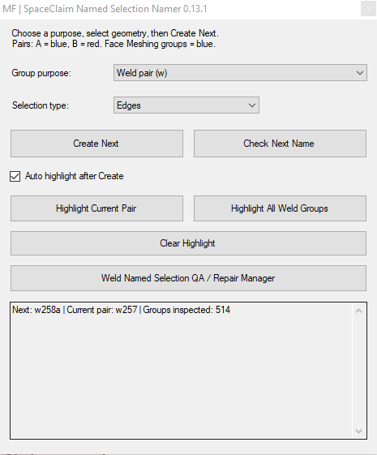
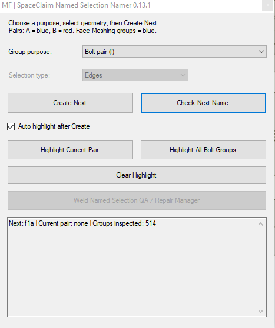
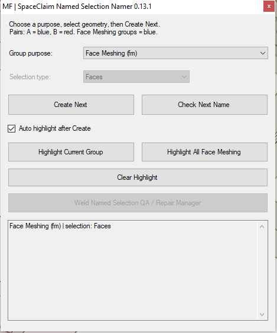
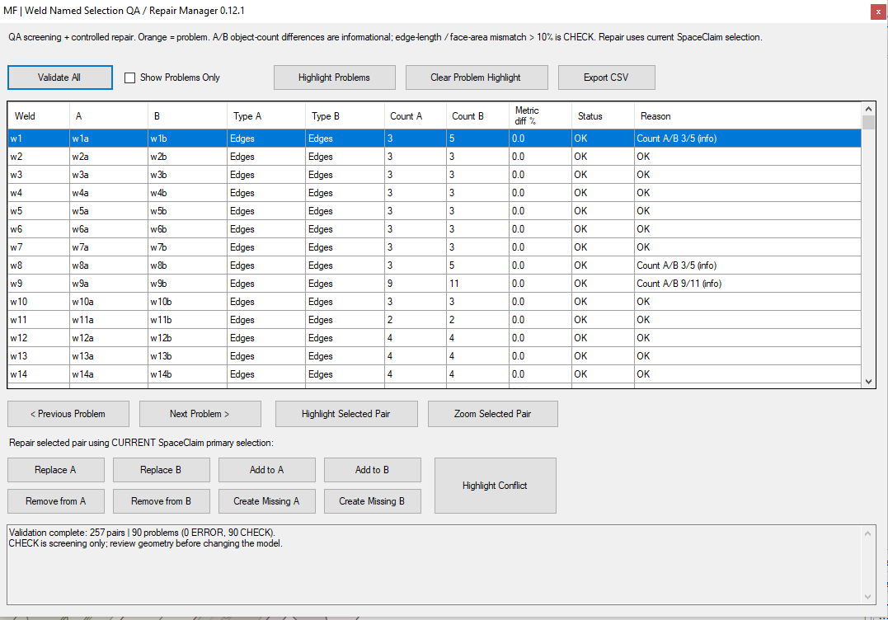
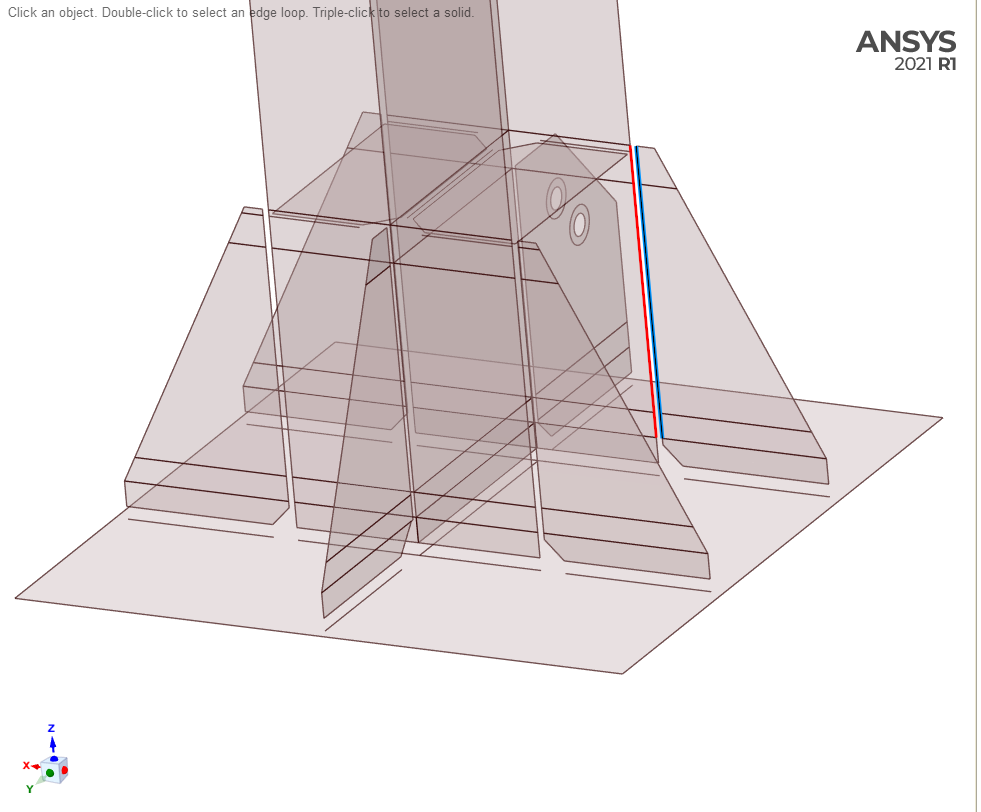
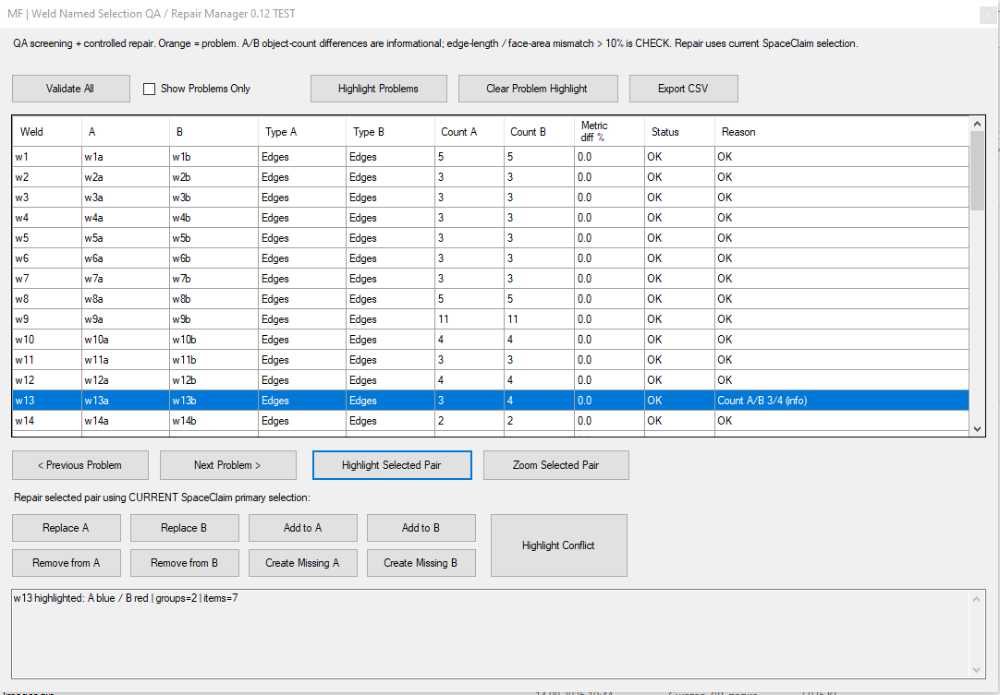

# SpaceClaim Named Selection Namer

Полуавтоматическое создание Named Selection для швов, болтовых соединений и Mechanical Face Meshing в **SpaceClaim 2021 R1 / API V19 / IronPython 2.7**. Для сварных групп доступны также QA-проверка и исправление.

**Текущая версия: v0.13.1**

> Скрипт для Script Editor в SpaceClaim. Не является ACT extension или DLL.

## Последовательности имён

| Назначение | Геометрия | Имена | Подсветка |
| --- | --- | --- | --- |
| Weld Pair | Faces или Edges | `w1a`, `w1b` … `w99999999b` | A синяя, B красная |
| Bolt Pair | Edges | `f1a`, `f1b` … `f999999b` | A синяя, B красная |
| Mechanical Face Meshing | Faces | `fm1` … `fm999999999` | Синяя |

Выберите геометрию и нажмите **Create Next**: все выбранные объекты попадут в одну группу. Каждая последовательность независимо заполняет пропуски, имена сравниваются без учёта регистра и существующие группы сохраняются. **Check Next Name** показывает следующее имя. Автоматическая подсветка, Highlight Current и Highlight All следуют выбранному назначению; **Clear Highlight** очищает временные цвета. QA / Repair Manager работает только со сварными группами `w`.

Работу Bolt Pair и Face Meshing вместе с подсветкой пользователь подтвердил в SpaceClaim 2021 R1. Подробности — в [таблице проверок](docs/VALIDATION.md).

## Скриншоты интерфейса v0.13.1

Реальные снимки из SpaceClaim 2021 R1.

**Weld Pair** — последовательные группы швов и текущая пара:



**Bolt Pair** — группы рёбер `fNa/fNb`:



**Face Meshing** — группы граней `fmN`:



**Weld Named Selection QA / Repair Manager** — пример таблицы проверки модели пользователя. Строки CHECK требуют оценки с учётом конкретной модели.



## Для чего создан инструмент

Утилита появилась из реальной задачи подготовки большой детализированной submodel с большим количеством сварных соединений. Для каждого шва формируется пара Named Selection:

```text
w1a / w1b
w2a / w2b
w3a / w3b
...
```

При десятках и сотнях швов ручное создание, последовательное именование и проверка этих групп становится рутинной и легко приводит к ошибкам. При этом сам выбор геометрии должен оставаться инженерным решением.

Поэтому SpaceClaim Weld Namer специально сделан **полуавтоматическим**: инженер выбирает нужные рёбра/грани, а программа берёт на себя именование, визуализацию, QA и контролируемое исправление групп.

## Основной workflow

```text
Выбор геометрии шва в SpaceClaim
        ↓
Create Next
        ↓
wNa / wNb
        ↓
A = синяя подсветка, B = красная
        ↓
QA / Repair Manager
        ↓
ANSYS Mechanical
        ↓
MPC184 Viewer
```

## Сварной режим, сохранённый от v0.12.0

### Последовательное создание Named Selection

```text
w1a -> w1b -> w2a -> w2b -> ... -> w99999999b
```

- поиск первого свободного имени без учёта регистра;
- автоматическое заполнение пропусков;
- несколько выбранных объектов в одной группе;
- существующие weld-группы не перезаписываются обычной командой Create Next;
- номер каждый раз определяется по реальным группам корневой детали, отдельного счётчика нет.

### Раздельная подсветка A/B

- `w...a` — штатная SpaceClaim **Secondary Selection** (на проверенной установке синяя);
- `w...b` — временная **красная `Display.Graphic`**;
- исходные цвета CAD-геометрии не изменяются;
- Auto Highlight, `Highlight Current Pair` и `Highlight All Weld Groups` используют одинаковую схему;
- `Clear Highlight` очищает обе подсветки.



### Named Selection QA Manager

QA Manager собирает сварочные группы по парам и проверяет:

- отсутствие стороны A или B;
- пустую / неразрешённую группу;
- смешанный или неподдерживаемый тип геометрии;
- различие типов A/B;
- одну и ту же геометрию одновременно в A и B;
- повторное использование геометрии другим weld Named Selection;
- дубли имён без учёта регистра;
- пропуски последовательности;
- отличие суммарной длины Edges или площади Faces больше screening-допуска (по умолчанию 10%).

Разница количества объектов A/B показывается как **информация**, а не автоматически как ошибка: физически корректные стороны одного шва могут быть по-разному разбиты топологией.

Доступны:

- **Validate All**;
- **Show Problems Only**;
- **Highlight Problems** — проблемные места оранжевым;
- **Previous Problem / Next Problem**;
- **Highlight Selected Pair**;
- **Zoom Selected Pair**;
- **Export CSV**.



> QA-статус — это screening подготовки геометрии/модели, а не расчётная оценка допустимости сварного соединения.

### Controlled Repair Manager

Для выбранной пары можно использовать текущее primary selection SpaceClaim и выполнить:

- **Replace A / Replace B**;
- **Add to A / Add to B**;
- **Remove from A / Remove from B**;
- **Create Missing A / Create Missing B**;
- **Highlight Conflict** для повторно используемой геометрии.

Перед изменением проверяется тип геометрии и запрашивается подтверждение. После операции Named Selection перечитывается и фактический состав сравнивается с ожидаемым, затем QA обновляется.

Для изменения существующей группы используется штатный V19 `NamedSelection.Replace(...)`. Свойство `Group.Members` рассматривается как read-only и напрямую не изменяется.

## Проверка в реальном SpaceClaim

v0.12.0 переведена в stable после успешной проверки на реальной установке:

- **ANSYS SpaceClaim 2021 R1**;
- **Script API V19**;
- встроенный **IronPython 2.7**;
- большой Edge-based набор сварочных Named Selection;
- при тесте общей подсветки обработано как минимум **104 weld-группы / 346 объектов геометрии**;
- подтверждена синяя A / красная B подсветка;
- QA / Repair Manager успешно работал;
- пользователь подтвердил успешную работу Repair workflow.

Поддержка Faces реализована, включая QA по площади и красную отрисовку границ Faces, но основной публично подтверждённый workflow v0.12.0 — **Edges**.

Подробнее: [docs/VALIDATION.md](docs/VALIDATION.md).

## Требования

- ANSYS SpaceClaim **2021 R1**
- Script API **V19**
- встроенный **IronPython 2.7**
- при создании/исправлении групп активна корневая деталь / root component

Другие версии SpaceClaim могут работать, но в v0.12.0 это не заявляется как подтверждённая совместимость.

## Быстрый старт

1. Открыть модель и активировать **root component**.
2. Открыть `Weld_Namer.py` в Script Editor.
3. Выбрать **API V19**.
4. Выполнить весь файл.
5. Выбрать `Edges` или `Faces`.
6. Выбрать геометрию и нажать **Create Next**.
7. Для проверки и исправления открыть **Named Selection QA / Repair Manager**.

Лог стабильной версии:

```text
%TEMP%\SpaceClaim_Weld_Namer_v012.log
```

## Сохранённая рабочая API-цепочка

Обычное создание Named Selection по-прежнему использует проверенную цепочку:

```text
Selection.GetActive()
NamedSelection.GetGroups(root)
NamedSelection.Create(selection, Selection.Empty())
NamedSelection.Rename(temporary_name, target)
```

Важные особенности проверенной установки:

- `Part.Groups` отсутствует;
- используется явный `NamedSelection.GetGroups(root)`;
- `NamedSelection.GetGroups()` без аргумента ранее приводил к null-reference из modeless callback;
- WinForms создаётся на UI-потоке SpaceClaim через `BeginInvoke`;
- AppDomain + `Monitor` предотвращают дубли окна при повторном Run;
- getter `Window.Rendering` может падать, когда custom-rendering slot пуст, поэтому стабильная overlay-логика записывает `Window.Rendering` напрямую и вызывает `RefreshRendering()` без предварительного чтения getter.

Подробнее: [docs/ARCHITECTURE.md](docs/ARCHITECTURE.md).

## Связанный проект

**MPC184 Viewer:** https://github.com/maximofflove/MPC184Viewer

SpaceClaim Weld Namer подготавливает пары `wNa / wNb`, после чего MPC184 Viewer используется в Mechanical для создания, проверки, визуализации и обработки MPC184 сварных связей.

## Лицензия

GNU General Public License v3.0. См. [LICENSE](LICENSE).

## Поддержка

Программа полностью бесплатная и open source. Добровольная поддержка разработки:

**https://boosty.to/ansys2021/donate**
